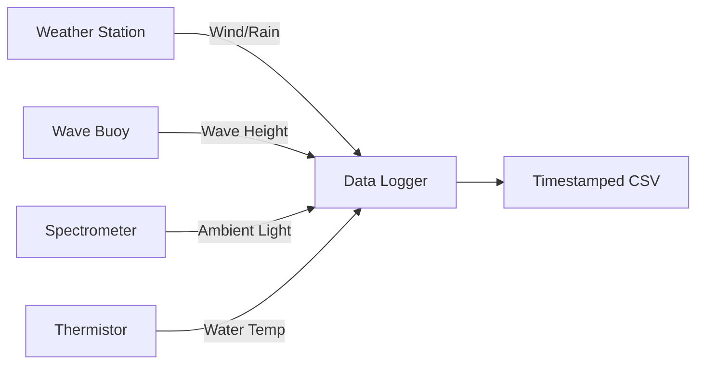

# Input Data Format Specification for Bioluminescent Detection AI Model

## Overview

This document provides the complete specification for input data formats accepted by the Bioluminescent Detection AI Model. The system supports multiple input formats with comprehensive validation and processing capabilities.

## Table of Contents

1. [Core Data Structure](#1-core-data-structure)
2. [Detailed Field Specifications](#2-detailed-field-specifications)
3. [Accepted Input Formats](#3-accepted-input-formats)
4. [Data Validation Rules](#4-data-validation-rules)
5. [Data Collection Protocol](#5-data-collection-protocol)
6. [Example Field Data Collection](#6-example-field-data-collection)
7. [Special Cases Handling](#7-special-cases-handling)
8. [API Integration](#8-api-integration)
9. [Error Handling](#9-error-handling)

---

## 1. Core Data Structure

### JSON Format (Recommended)

```json
{
  "temporal_parameters": {
    "activation_time": 45.0, // Minutes since activation
    "water_temperature": 8.5 // °C
  },
  "environmental_conditions": {
    "wind_speed": 5.2, // m/s (at 10m height)
    "precipitation": 2.4, // mm/hr
    "wave_height": 1.2, // m (significant wave height)
    "ambient_light": 0.002, // lux
    "water_turbidity": 1.8, // NTU (optional)
    "current_speed": 0.4 // knots (optional)
  },
  "sensor_parameters": {
    "type": "drone", // "human", "drone", or "nvg"
    "model": "DJI_M30T", // Sensor-specific ID (optional)
    "spectral_range": [450, 550] // nm (optional)
  },
  "product_parameters": {
    "bead_density": 350, // Beads per unit (optional)
    "batch_id": "LXB-2025-08" // Optional
  }
}
```

---

## 2. Detailed Field Specifications

| **Category**      | **Parameter**     | **Type**       | **Units** | **Range**  | **Required** | **Description**                       |
| ----------------- | ----------------- | -------------- | --------- | ---------- | ------------ | ------------------------------------- |
| **Temporal**      | activation_time   | float          | minutes   | 0-360      | Yes          | Time since bead activation            |
|                   | water_temperature | float          | °C        | -2 to 30   | Yes          | Water temperature at deployment depth |
| **Environmental** | wind_speed        | float          | m/s       | 0-25       | Yes          | 10-minute average at 10m height       |
|                   | precipitation     | float          | mm/hr     | 0-50       | Yes          | Rain/fog precipitation rate           |
|                   | wave_height       | float          | m         | 0-10       | Yes          | Significant wave height               |
|                   | ambient_light     | float          | lux       | 0.0001-0.1 | Yes          | Background illuminance                |
|                   | water_turbidity   | float          | NTU       | 0-10       | No           | Water clarity (default: 1.5)          |
|                   | current_speed     | float          | knots     | 0-5        | No           | Surface current speed                 |
| **Sensor**        | type              | string         | -         | enum       | Yes          | Detection system type                 |
|                   | model             | string         | -         | -          | No           | Specific sensor model                 |
|                   | spectral_range    | [float, float] | nm        | 350-900    | No           | Detection wavelength range            |
| **Product**       | bead_density      | int            | count     | 100-1000   | No           | Beads per deployment unit             |
|                   | batch_id          | string         | -         | -          | No           | Manufacturing batch                   |

### Sensor Type Mapping

```python
SENSOR_THRESHOLDS = {
    "human": 0.001,    # Human eye detection threshold (lux)
    "drone": 0.005,    # Drone camera detection threshold (lux)
    "nvg": 0.0005      # Night vision goggles threshold (lux)
}
```

---

## 3. Accepted Input Formats

### Option 1: JSON (Recommended)

**Single Prediction:**

```json
{
  "temporal_parameters": {
    "activation_time": 45.0,
    "water_temperature": 8.5
  },
  "environmental_conditions": {
    "wind_speed": 5.2,
    "precipitation": 2.4,
    "wave_height": 1.2,
    "ambient_light": 0.002
  },
  "sensor_parameters": {
    "type": "drone"
  }
}
```

**Bulk Predictions:**

```json
{
  "predictions": [
    {
      "temporal_parameters": {
        "activation_time": 45.0,
        "water_temperature": 8.5
      },
      "environmental_conditions": {
        "wind_speed": 5.2,
        "precipitation": 2.4,
        "wave_height": 1.2,
        "ambient_light": 0.002
      },
      "sensor_parameters": { "type": "drone" }
    },
    {
      "temporal_parameters": {
        "activation_time": 60.0,
        "water_temperature": 10.2
      },
      "environmental_conditions": {
        "wind_speed": 3.1,
        "precipitation": 0.0,
        "wave_height": 0.5,
        "ambient_light": 0.0005
      },
      "sensor_parameters": { "type": "nvg" }
    }
  ]
}
```

### Option 2: CSV (Single Prediction)

```csv
parameter_category,parameter,value,units
temporal,activation_time,45.0,minutes
temporal,water_temperature,8.5,C
environmental,wind_speed,5.2,m/s
environmental,precipitation,2.4,mm/hr
environmental,wave_height,1.2,m
environmental,ambient_light,0.002,lux
sensor,type,drone,na
```

### Option 3: CSV (Bulk Predictions)

```csv
activation_time,water_temp,wind_speed,precip,wave_ht,ambient_light,sensor_type
45.0,8.5,5.2,2.4,1.2,0.002,drone
60.0,10.2,3.1,0.0,0.5,0.0005,nvg
30.0,5.8,12.4,8.7,2.3,0.01,human
```

---

## 4. Data Validation Rules

### Range Validation

```python
# Activation time validation
if not (0 <= activation_time <= 360):
    raise ValueError("Activation time must be 0-360 minutes")

# Water temperature validation
if not (-2 <= water_temperature <= 30):
    raise ValueError("Water temperature must be -2 to 30°C")

# Wind speed validation (with capping)
if wind_speed > 25:
    wind_speed = 25.0  # Cap at 25 m/s with warning

# Ambient light validation
if ambient_light < 0.0001:
    ambient_light = 0.0001  # Set to minimum detectable
```

### Sensor Type Validation

```python
VALID_SENSOR_TYPES = ["human", "drone", "nvg"]

if sensor_type not in VALID_SENSOR_TYPES:
    raise ValueError(f"Sensor type must be one of: {VALID_SENSOR_TYPES}")
```

### Unit Conversions

```python
# Convert knots to m/s if needed
if 'current_speed' in data and data['current_unit'] == 'knots':
    data['current_speed'] *= 0.514  # knots → m/s

# Convert temperature if needed
if 'water_temperature_unit' in data and data['water_temperature_unit'] == 'F':
    data['water_temperature'] = (data['water_temperature'] - 32) * 5/9  # F → C
```

---

## 5. Data Collection Protocol

### Environmental Sensors Setup



### Minimum Required Data

```python
REQUIRED_FIELDS = [
    'activation_time',
    'water_temperature',
    'wind_speed',
    'precipitation',
    'wave_height',
    'ambient_light',
    'sensor_type'
]
```

### Data Collection Frequency

- **Environmental Data**: Every 5 minutes during tests
- **Temporal Data**: Synchronized with GPS clock (UTC)
- **Detection Results**: Immediately after each test

---

## 6. Example Field Data Collection

### Marine Weather Station Output

```csv
timestamp,lat,lon,wind_speed(m/s),precip(mm/hr),wave_height(m),ambient_light(lux),water_temp(C)
2023-08-15T22:30:00Z,48.423,-123.367,5.2,2.4,1.2,0.002,8.5
2023-08-15T22:35:00Z,48.423,-123.367,5.5,2.1,1.3,0.002,8.4
2023-08-15T22:40:00Z,48.423,-123.367,5.8,1.8,1.1,0.002,8.6
```

### Deployment Log Entry

```json
{
  "activation_time": "2023-08-15T22:15:00Z",
  "sensor_type": "drone",
  "bead_density": 350,
  "notes": "Test series #5 - moderate conditions"
}
```

### Combined Input for Model

```json
{
  "temporal_parameters": {
    "activation_time": 45.0, // 22:30 - 22:15 = 45 mins
    "water_temperature": 8.5
  },
  "environmental_conditions": {
    "wind_speed": 5.2,
    "precipitation": 2.4,
    "wave_height": 1.2,
    "ambient_light": 0.002
  },
  "sensor_parameters": {
    "type": "drone"
  }
}
```

---

## 7. Special Cases Handling

### Missing Data

```python
# Default values for optional parameters
DEFAULT_VALUES = {
    "water_turbidity": 1.5,    # Default coastal water
    "current_speed": 0.0,      # Default no current
    "bead_density": 350,       # Default bead count
    "spectral_range": None     # Default no spectral range
}

# Apply defaults for missing data
for param, default_value in DEFAULT_VALUES.items():
    if param not in data:
        data[param] = default_value
```

### Extreme Conditions

```python
# Wind speed handling
if wind_speed > 25:
    wind_speed = 25.0
    warnings.append("Wind speed capped at 25 m/s")

# Wave height handling
if wave_height > 10:
    wave_height = 10.0
    warnings.append("Wave height capped at 10 m")

# Return "0 visibility" for extreme conditions
if wind_speed > 20 and wave_height > 5:
    return {"distance": 0, "warning": "Extreme conditions - no visibility"}
```

### Night Vision Goggles (NVG)

```python
# Special handling for NVG
if sensor_type == "nvg":
    ambient_light = max(ambient_light, 1e-5)  # Avoid division by zero
    warnings.append("Ambient light adjusted for NVG operation")
```

---

## 8. API Integration

### REST API Endpoints

```bash
# Single prediction
POST /predict
Content-Type: application/json

# Bulk predictions
POST /predict/bulk
Content-Type: application/json

# Input validation only
POST /validate/input
Content-Type: application/json

# Upload weather station data
POST /upload/weather-station
Content-Type: multipart/form-data
```

### Example API Calls

```bash
# Single prediction
curl -X POST "http://localhost:8000/predict" \
     -H "Content-Type: application/json" \
     -d '{
       "temporal_parameters": {
         "activation_time": 45.0,
         "water_temperature": 8.5
       },
       "environmental_conditions": {
         "wind_speed": 5.2,
         "precipitation": 2.4,
         "wave_height": 1.2,
         "ambient_light": 0.002
       },
       "sensor_parameters": {
         "type": "drone"
       }
     }'

# Bulk predictions
curl -X POST "http://localhost:8000/predict/bulk" \
     -H "Content-Type: application/json" \
     -d '{
       "predictions": [
         {
           "temporal_parameters": {"activation_time": 45.0, "water_temperature": 8.5},
           "environmental_conditions": {"wind_speed": 5.2, "precipitation": 2.4, "wave_height": 1.2, "ambient_light": 0.002},
           "sensor_parameters": {"type": "drone"}
         }
       ]
     }'
```

### Python SDK Usage

```python
from data_models import DataProcessor, DetectionInput
from bioluminescence_model import BioluminescenceModel

# Initialize components
data_processor = DataProcessor()
model = BioluminescenceModel()

# Validate input
input_data = {
    "temporal_parameters": {"activation_time": 45.0, "water_temperature": 8.5},
    "environmental_conditions": {"wind_speed": 5.2, "precipitation": 2.4, "wave_height": 1.2, "ambient_light": 0.002},
    "sensor_parameters": {"type": "drone"}
}

validation_result = data_processor.validate_json_input(input_data)

if validation_result.is_valid:
    # Convert to model input
    model_input = data_processor.convert_to_model_input(validation_result.processed_data)

    # Make prediction
    result = model.predict(**model_input)
    print(f"Predicted distance: {result['distance']:.0f} m")
else:
    print(f"Validation errors: {validation_result.errors}")
```

---

## 9. Error Handling

### Validation Error Types

```python
class ValidationError(Exception):
    """Base class for validation errors"""
    pass

class RangeError(ValidationError):
    """Parameter value outside valid range"""
    pass

class MissingFieldError(ValidationError):
    """Required field missing"""
    pass

class UnitConversionError(ValidationError):
    """Error in unit conversion"""
    pass
```

### Error Response Format

```json
{
  "error": "Validation failed",
  "details": {
    "field": "wind_speed",
    "value": 30.0,
    "message": "Wind speed exceeds maximum of 25 m/s",
    "suggestion": "Value will be capped at 25 m/s"
  },
  "warnings": [
    "Wind speed capped at 25 m/s",
    "Ambient light adjusted for NVG operation"
  ]
}
```

### Common Error Codes

| **Error Code**       | **Description**             | **Solution**                    |
| -------------------- | --------------------------- | ------------------------------- |
| `MISSING_FIELD`      | Required field not provided | Add missing field               |
| `INVALID_RANGE`      | Value outside valid range   | Adjust value to valid range     |
| `INVALID_SENSOR`     | Unsupported sensor type     | Use: human, drone, or nvg       |
| `UNIT_CONVERSION`    | Error in unit conversion    | Check unit specification        |
| `EXTREME_CONDITIONS` | Conditions too extreme      | Reduce environmental parameters |

---

## Summary

This input format specification ensures:

✅ **Consistent Data Structure**: Standardized format across all inputs
✅ **Comprehensive Validation**: Range checks, type validation, and unit conversion
✅ **Flexible Input Methods**: JSON, CSV, and bulk processing support
✅ **Error Handling**: Clear error messages and suggestions
✅ **Extensibility**: Easy to add new parameters and validation rules
✅ **Integration Ready**: Compatible with existing systems and APIs

The specification supports both simple single predictions and complex bulk processing scenarios, making it suitable for both research and operational deployment environments.
