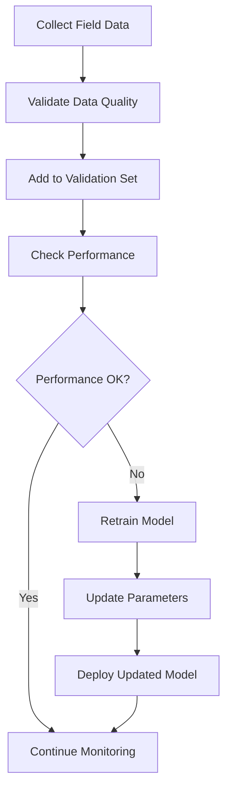

# 🎯 Model Training Guide - Bioluminescent Detection AI

This guide explains how to train and calibrate the bioluminescent detection AI model using real field data to improve prediction accuracy.

## 📋 Table of Contents

1. [Overview](#overview)
2. [Training Process](#training-process)
3. [Data Requirements](#data-requirements)
4. [Training Methods](#training-methods)
5. [Performance Evaluation](#performance-evaluation)
6. [Continuous Learning](#continuous-learning)
7. [Best Practices](#best-practices)
8. [Examples](#examples)

---

## 🎯 Overview

The bioluminescent detection AI model uses **physics-based modeling** combined with **machine learning calibration** to predict detection distances. Training involves:

- **Parameter Calibration**: Optimizing model parameters using field data
- **Performance Validation**: Evaluating prediction accuracy
- **Continuous Learning**: Improving the model with new data

### Key Components

1. **Light Decay Model**: Arrhenius kinetics for bioluminescence decay
2. **Environmental Attenuation**: Wind, precipitation, and wave effects
3. **Detection Threshold**: Sensor-specific minimum detectable levels
4. **Distance Calculation**: Logarithmic relationship between intensity and distance

---

## 🔄 Training Process

### Step-by-Step Training Workflow

```python
from bioluminescence_model import BioluminescenceModel
import pandas as pd

# 1. Initialize model
model = BioluminescenceModel()

# 2. Load field data
field_data = pd.read_csv('calibration_data.csv')

# 3. Evaluate initial performance
initial_performance = evaluate_model(model, field_data)

# 4. Train/calibrate model
optimized_params = model.calibrate_parameters(field_data)

# 5. Evaluate improved performance
improved_performance = evaluate_model(model, field_data)

# 6. Save training results
save_training_results(optimized_params, initial_performance, improved_performance)
```

### Quick Training Example

```bash
# Run the training guide
python model_training_guide.py

# Or use the API for training
curl -X POST "http://localhost:8000/calibrate" \
     -H "Content-Type: application/json" \
     -d @calibration_data.json
```

---

## 📊 Data Requirements

### Required Fields

| Field             | Type   | Range           | Description                 |
| ----------------- | ------ | --------------- | --------------------------- |
| `actual_distance` | float  | 0-1000 m        | Measured detection distance |
| `activation_time` | float  | 0-360 min       | Time since activation       |
| `water_temp`      | float  | -2 to 30 °C     | Water temperature           |
| `wind_speed`      | float  | 0-25 m/s        | Wind speed                  |
| `precipitation`   | float  | 0-50 mm/hr      | Precipitation rate          |
| `wave_height`     | float  | 0-10 m          | Wave height                 |
| `ambient_light`   | float  | 0.0001-0.1 lux  | Ambient light level         |
| `sensor_type`     | string | human/drone/nvg | Sensor type                 |

### Optional Fields

| Field                  | Type   | Description                |
| ---------------------- | ------ | -------------------------- |
| `test_location`        | string | Test location name         |
| `test_date`            | string | Test date (YYYY-MM-DD)     |
| `detection_confidence` | float  | Detection confidence (0-1) |
| `notes`                | string | Additional notes           |

### Data Quality Requirements

- **Minimum samples**: 10
- **Recommended samples**: 50+
- **Data variety**: Different environmental conditions
- **Accuracy**: Precise distance measurements
- **Consistency**: Standardized measurement protocols

---

## 🧠 Training Methods

### 1. Parameter Calibration

The model uses **Bayesian optimization** to calibrate parameters:

```python
def calibrate_parameters(self, field_data: pd.DataFrame) -> Dict[str, float]:
    """
    Calibrate model parameters using field data.

    Parameters optimized:
    - I0: Initial light intensity
    - A: Arrhenius prefactor
    - Ea: Activation energy
    - alpha1: Wind coefficient
    - alpha2: Precipitation coefficient
    - alpha3: Wave height coefficient
    - gamma: Ambient light scaling
    """
```

### 2. Optimization Algorithm

- **Method**: L-BFGS-B (Limited-memory BFGS with Bounds)
- **Objective**: Minimize Mean Absolute Error (MAE)
- **Bounds**: Physical parameter constraints
- **Iterations**: Up to 50 optimization steps

### 3. Parameter Bounds

```python
bounds = [
    (8, 12),      # I0: Initial intensity
    (0.01, 0.02), # A: Arrhenius prefactor
    (40000, 60000), # Ea: Activation energy
    (0.01, 0.03), # alpha1: Wind coefficient
    (0.015, 0.035), # alpha2: Precipitation coefficient
    (0.02, 0.04), # alpha3: Wave height coefficient
    (1.0, 2.0)    # gamma: Ambient scaling
]
```

---

## 📈 Performance Evaluation

### Evaluation Metrics

1. **Mean Absolute Error (MAE)**

   - Average absolute difference between predicted and actual distances
   - Units: meters
   - Target: < 50 m

2. **Mean Absolute Percentage Error (MAPE)**

   - Average percentage error
   - Units: percentage
   - Target: < 15%

3. **Root Mean Square Error (RMSE)**

   - Square root of average squared errors
   - Units: meters
   - Target: < 75 m

4. **R-squared (R²)**
   - Coefficient of determination
   - Range: 0-1
   - Target: > 0.8

### Performance Targets

| Metric | Excellent | Good   | Acceptable |
| ------ | --------- | ------ | ---------- |
| MAE    | < 25 m    | < 50 m | < 100 m    |
| MAPE   | < 10%     | < 15%  | < 25%      |
| RMSE   | < 40 m    | < 75 m | < 150 m    |
| R²     | > 0.9     | > 0.8  | > 0.7      |

---

## 🔄 Continuous Learning

### Adaptive Learning Process

The model supports continuous improvement through:

1. **Validation Data Collection**

   ```python
   model.add_validation_data({
       'actual_distance': 450,
       'activation_time': 50,
       'water_temp': 9.0,
       'wind_speed': 4.5,
       'precipitation': 1.8,
       'wave_height': 1.0,
       'ambient_light': 0.0015,
       'sensor_type': 'drone'
   })
   ```

2. **Automatic Retraining**

   ```python
   model._retrain_from_validation_data()
   ```

3. **Performance Monitoring**
   - Track accuracy over time
   - Identify degradation patterns
   - Trigger retraining when needed

### Learning Workflow



---

## ✅ Best Practices

### Data Collection

1. **Environmental Diversity**

   - Test across different weather conditions
   - Include various wind speeds and directions
   - Cover different precipitation levels
   - Test at different times of day

2. **Sensor Coverage**

   - Test all sensor types (human, drone, NVG)
   - Include different sensor models
   - Test various ambient light conditions

3. **Measurement Accuracy**
   - Use precise distance measurement tools
   - Record environmental conditions accurately
   - Maintain consistent measurement protocols
   - Document any anomalies or special conditions

### Training Process

1. **Data Preparation**

   - Clean and validate input data
   - Remove outliers and invalid measurements
   - Ensure data format consistency
   - Split data into training and validation sets

2. **Model Calibration**

   - Start with default parameters
   - Use sufficient training data (50+ samples)
   - Monitor convergence during optimization
   - Validate results on test data

3. **Performance Validation**
   - Test on unseen data
   - Evaluate across different conditions
   - Monitor for overfitting
   - Document performance metrics

### Deployment

1. **Model Versioning**

   - Track parameter changes
   - Document training data used
   - Maintain performance history
   - Version control for reproducibility

2. **Monitoring**
   - Track prediction accuracy
   - Monitor for performance drift
   - Collect feedback from field use
   - Plan regular retraining cycles

---

## 📝 Examples

### Example 1: Basic Training

```python
from bioluminescence_model import BioluminescenceModel
import pandas as pd

# Load training data
training_data = pd.read_csv('field_data.csv')

# Initialize and train model
model = BioluminescenceModel()
optimized_params = model.calibrate_parameters(training_data)

print("Training completed!")
print(f"Optimized parameters: {optimized_params}")
```

### Example 2: API Training

```bash
# Prepare calibration data
cat > calibration_data.json << EOF
{
  "field_data": [
    {
      "actual_distance": 427,
      "activation_time": 45,
      "water_temp": 8.5,
      "wind_speed": 5.2,
      "precipitation": 2.4,
      "wave_height": 1.2,
      "ambient_light": 0.002,
      "sensor_type": "drone"
    }
  ]
}
EOF

# Train via API
curl -X POST "http://localhost:8000/calibrate" \
     -H "Content-Type: application/json" \
     -d @calibration_data.json
```

### Example 3: Continuous Learning

```python
# Add new validation data
new_data = {
    'actual_distance': 450,
    'activation_time': 50,
    'water_temp': 9.0,
    'wind_speed': 4.5,
    'precipitation': 1.8,
    'wave_height': 1.0,
    'ambient_light': 0.0015,
    'sensor_type': 'drone'
}

model.add_validation_data(new_data)
model._retrain_from_validation_data()
```

### Example 4: Performance Evaluation

```python
def evaluate_model(model, test_data):
    predictions = []
    for _, row in test_data.iterrows():
        result = model.predict(
            activation_time=row['activation_time'],
            water_temp=row['water_temp'],
            wind_speed=row['wind_speed'],
            precipitation=row['precipitation'],
            wave_height=row['wave_height'],
            ambient_light=row['ambient_light'],
            sensor_type=row['sensor_type']
        )
        predictions.append(result['distance'])

    # Calculate metrics
    mae = np.mean(np.abs(test_data['actual_distance'] - predictions))
    mape = np.mean(np.abs((test_data['actual_distance'] - predictions) / test_data['actual_distance'])) * 100

    print(f"MAE: {mae:.1f} m")
    print(f"MAPE: {mape:.1f}%")

    return mae, mape
```

---

## 📁 Data Templates

### CSV Template

Use the provided CSV template for data collection:

```bash
# Copy the calibration template
cp data_formats/calibration_data_template.csv my_field_data.csv

# Fill in your field measurements
# Upload via API or use in training script
```

### JSON Template

```json
{
  "field_data": [
    {
      "actual_distance": 427,
      "activation_time": 45,
      "water_temp": 8.5,
      "wind_speed": 5.2,
      "precipitation": 2.4,
      "wave_height": 1.2,
      "ambient_light": 0.002,
      "sensor_type": "drone",
      "test_location": "Seattle_Bay",
      "test_date": "2024-01-15",
      "detection_confidence": 0.85
    }
  ]
}
```

---

## 🚀 Quick Start

1. **Collect Field Data**

   ```bash
   # Use the provided template
   cp data_formats/calibration_data_template.csv my_data.csv
   ```

2. **Run Training**

   ```bash
   # Run the training guide
   python model_training_guide.py

   # Or use the API
   curl -X POST "http://localhost:8000/calibrate" \
        -H "Content-Type: application/json" \
        -d @my_data.json
   ```

3. **Evaluate Results**

   ```bash
   # Check training results
   cat training_results.json
   ```

4. **Deploy Trained Model**
   ```bash
   # The model is automatically updated
   # Use for new predictions
   curl -X POST "http://localhost:8000/predict" \
        -H "Content-Type: application/json" \
        -d @prediction_request.json
   ```

---

## 📞 Support

For training assistance:

1. **Check the examples** in `model_training_guide.py`
2. **Use the data templates** in `data_formats/`
3. **Review the API documentation** at http://localhost:8000/docs
4. **Run the validation tests** with `python run_tests.py`

---

**Happy training! 🎯✨**
